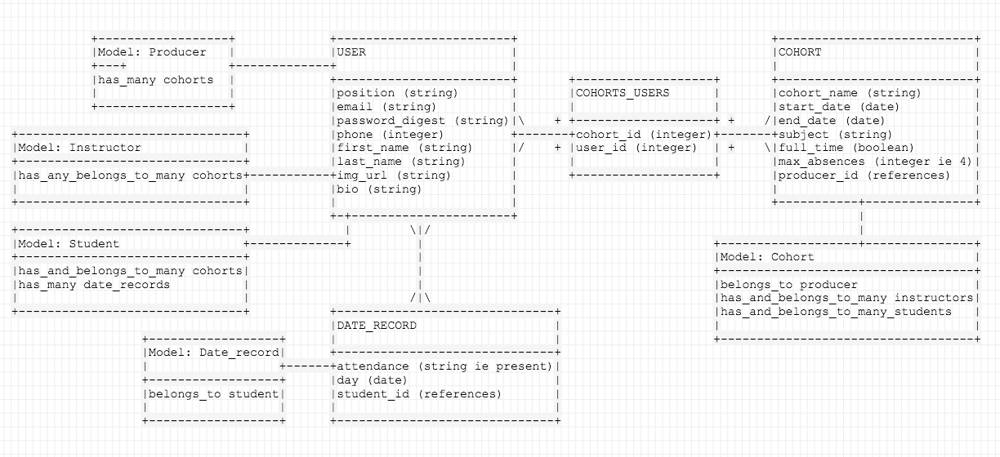
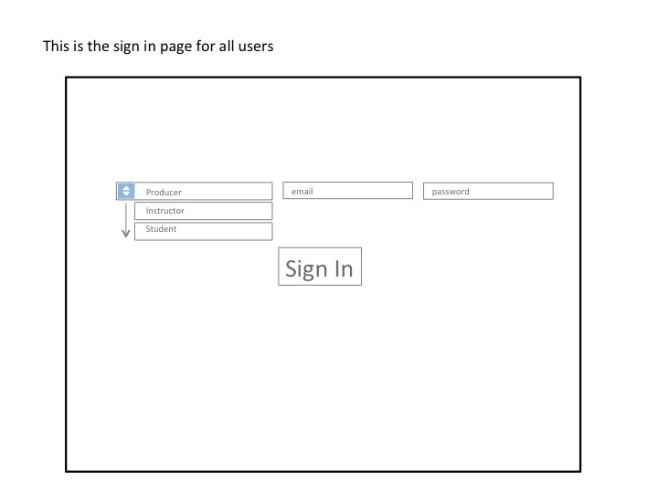
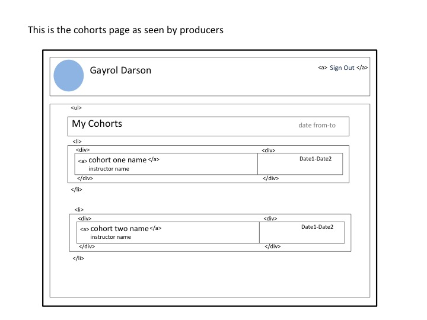
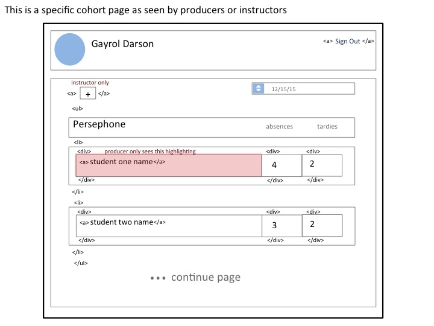
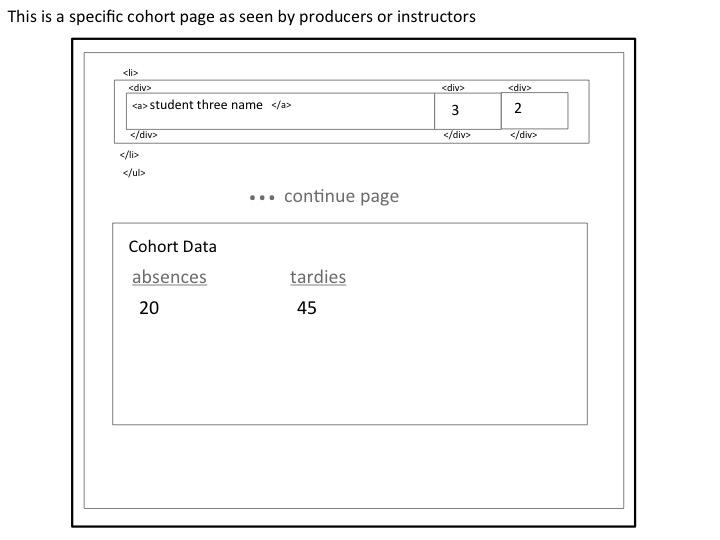
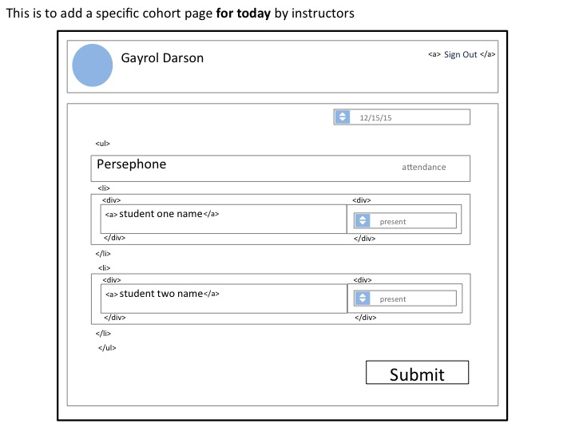
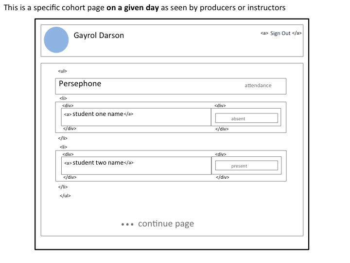
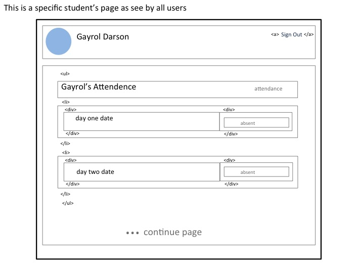
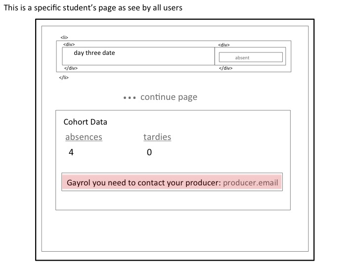

#Tracker Attendance#

##User Stories##
This application tracks the attendance of students across multiple GA cohorts.  Attendance Tracker can be used by Producers, Instructors and Students.  

###Students###
A student can sign up to the service after he or she has been invited by their cohort's instructor.  If the student has already enrolled in a previous course her or she can sign-in using their previous password.  Once the student does this he or she can either create or edit their profile, as well as see his or her current attendance record for all enrolled classes.  If a student is running late he or she can text a specified number to indicate he or she is running late or sick.  The app will register in the student's records if the absence is excused or unexcused (sick or late).   More than four lates will accrue into one absence. If the student is in danger of getting four absences, he or she will receive a text with their attendance status.  Once the student reaches four absences a text will be sent indicating he or she must contact the cohort producer.  His or her personal page will also display a notification that he or she needs to contact the course producer with a link to email the producer. Students will not be able to see or edit other student's data.

###Instructors###
Once the Instructor has signed in he or she will be able to see a daily roster of their classes. Instructors will be able to mark every student as Present, Late, Unexcused Absence or Excused Absence.  An instructor may edit or view previous days' attendance records and the overall student data.  Instructors will have the ability to make new cohorts.  Once a cohort is created an e-mail will be automatically generated asking the student to sign in for the first time.  If a student has already taken a course with the school then they can use their previous information.

###Producers###
After a producer signs in they will see a list of all their cohorts. When the producer clicks on a cohort, they will be able to view the attendance records for each student in the class.  The students that need to be contacted due to poor attendence will be higlighted. The producer will be able to jump to specifc date and see the attendance record for the day.

##Technology##
- Ruby on Rails
- ActiveRecord
- HTML
- CSS
- JavaScript
- Heroku
- Chart.js
- Twilio
- ActionMailer

##ERD##

##Wireframes##

